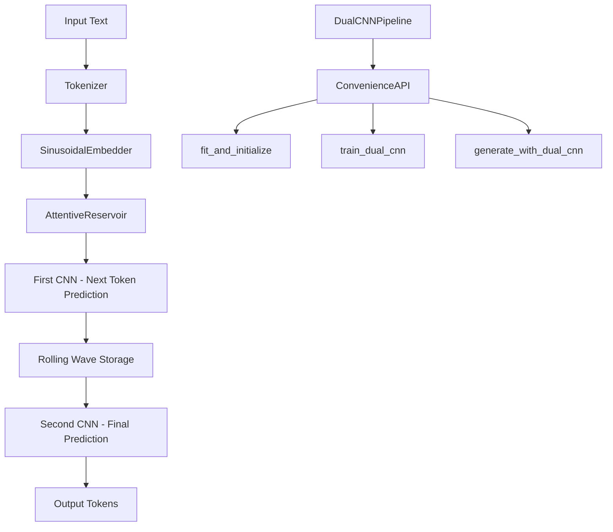

# Design Document

## Overview

The dual CNN convenience features will extend the existing LSM Lite architecture with streamlined methods for setting up and managing a dual CNN training pipeline. This design introduces a new `DualCNNPipeline` class that orchestrates the complete workflow: embedder fitting, attentive reservoir initialization, first CNN for next-token prediction with rolling wave output storage, and a second CNN for final token prediction generation.

The design maintains full compatibility with the existing LSM Lite API while providing simplified convenience methods for common dual CNN workflows.

## Architecture

### High-Level Architecture



### Component Integration

The dual CNN convenience features integrate with existing LSM Lite components:

- **Existing Components**: `UnifiedTokenizer`, `SinusoidalEmbedder`, `SparseReservoir`, `CNNProcessor`
- **New Components**: `AttentiveReservoir`, `RollingWaveStorage`, `DualCNNPipeline`, `DualCNNTrainer`
- **Enhanced Components**: Extended `LSMLite` API with dual CNN convenience methods

## Components and Interfaces

### 1. AttentiveReservoir

Extends the existing `SparseReservoir` with attention mechanisms for improved context awareness.

```python
class AttentiveReservoir(SparseReservoir):
    def __init__(self, input_dim: int, reservoir_size: int = 512,
                 attention_heads: int = 8, attention_dim: int = 64, **kwargs):
        # Inherits from SparseReservoir
        # Adds multi-head attention mechanism
        
    def call(self, inputs: tf.Tensor, training: bool = None) -> Tuple[tf.Tensor, tf.Tensor]:
        # Returns: (reservoir_states, attention_weights)
```

### 2. RollingWaveStorage

Manages efficient storage and retrieval of rolling wave outputs from the first CNN.

```python
class RollingWaveStorage:
    def __init__(self, max_sequence_length: int, feature_dim: int, 
                 window_size: int = 50, overlap: int = 10):
        # Manages circular buffer for rolling wave data
        
    def store_wave(self, wave_output: tf.Tensor, sequence_position: int):
        # Store wave output with position tracking
        
    def get_wave_sequence(self, start_pos: int, length: int) -> tf.Tensor:
        # Retrieve wave sequence for second CNN
        
    def clear_storage(self):
        # Reset storage for new sequences
```

### 3. DualCNNPipeline

Main orchestrator for the dual CNN workflow.

```python
class DualCNNPipeline:
    def __init__(self, config: LSMConfig):
        self.config = config
        self.embedder = None
        self.reservoir = None
        self.first_cnn = None
        self.second_cnn = None
        self.wave_storage = None
        
    def fit_and_initialize(self, training_data: List[str], 
                          embedder_params: dict = None,
                          reservoir_params: dict = None,
                          cnn_params: dict = None) -> None:
        # One-shot setup of entire pipeline
        
    def train_dual_cnn(self, training_data: List[str], 
                      epochs: int = 10, batch_size: int = 32) -> Dict[str, Any]:
        # Train both CNNs with rolling wave coordination
        
    def generate_tokens(self, prompt: str, max_length: int = 50) -> List[int]:
        # Generate tokens using dual CNN approach
```

### 4. Enhanced LSMLite API

Extension of the main API with convenience methods.

```python
class LSMLite:
    # Existing methods...
    
    def setup_dual_cnn_pipeline(self, **kwargs) -> DualCNNPipeline:
        # Create and return configured dual CNN pipeline
        
    def quick_dual_cnn_train(self, dataset_name: str, **kwargs) -> Dict[str, Any]:
        # One-line dual CNN training setup and execution
        
    def dual_cnn_generate(self, prompt: str, **kwargs) -> str:
        # Generate text using dual CNN approach
```

## Data Models

### 1. DualCNNConfig

Configuration object for dual CNN parameters.

```python
@dataclass
class DualCNNConfig:
    # Embedder configuration
    embedder_fit_samples: int = 10000
    embedder_batch_size: int = 256
    
    # Reservoir configuration
    reservoir_size: int = 512
    attention_heads: int = 8
    attention_dim: int = 64
    
    # First CNN configuration
    first_cnn_filters: List[int] = field(default_factory=lambda: [64, 128, 256])
    first_cnn_architecture: str = '2d'
    
    # Rolling wave configuration
    wave_window_size: int = 50
    wave_overlap: int = 10
    max_wave_storage: int = 1000
    
    # Second CNN configuration
    second_cnn_filters: List[int] = field(default_factory=lambda: [128, 256, 512])
    second_cnn_architecture: str = '2d'
    
    # Training configuration
    dual_training_epochs: int = 10
    wave_coordination_weight: float = 0.3
    final_prediction_weight: float = 0.7
```

### 2. TrainingProgress

Progress tracking for dual CNN training.

```python
@dataclass
class TrainingProgress:
    current_epoch: int
    first_cnn_loss: float
    second_cnn_loss: float
    combined_loss: float
    wave_storage_utilization: float
    attention_entropy: float
    estimated_time_remaining: float
```

### 3. WaveOutput

Structure for rolling wave output data.

```python
@dataclass
class WaveOutput:
    sequence_position: int
    wave_features: tf.Tensor
    attention_weights: tf.Tensor
    timestamp: float
    confidence_score: float
```

## Error Handling

### 1. Component Initialization Errors

```python
class ComponentInitializationError(Exception):
    def __init__(self, component_name: str, error_details: str):
        self.component_name = component_name
        self.error_details = error_details
        super().__init__(f"Failed to initialize {component_name}: {error_details}")
```

### 2. Wave Storage Errors

```python
class WaveStorageError(Exception):
    def __init__(self, operation: str, details: str):
        super().__init__(f"Wave storage {operation} failed: {details}")
```

### 3. Training Coordination Errors

```python
class DualCNNTrainingError(Exception):
    def __init__(self, stage: str, cnn_id: str, details: str):
        super().__init__(f"Dual CNN training failed at {stage} for {cnn_id}: {details}")
```

### Error Recovery Strategies

1. **Graceful Degradation**: If attention mechanism fails, fall back to standard reservoir
2. **Checkpoint Recovery**: Save intermediate states during training for recovery
3. **Memory Management**: Automatic cleanup of wave storage when memory limits reached
4. **Configuration Validation**: Pre-validate all parameters before initialization

## Testing Strategy

### 1. Unit Tests

- **Component Tests**: Individual testing of `AttentiveReservoir`, `RollingWaveStorage`, `DualCNNPipeline`
- **Integration Tests**: Test component interactions and data flow
- **Configuration Tests**: Validate parameter combinations and defaults

### 2. Performance Tests

- **Memory Usage**: Monitor wave storage memory consumption
- **Training Speed**: Compare dual CNN vs single CNN training times
- **Inference Speed**: Measure generation latency with dual CNN approach

### 3. Functional Tests

- **End-to-End Workflow**: Complete pipeline from raw text to token generation
- **Compatibility Tests**: Ensure existing LSM Lite functionality remains intact
- **Error Handling Tests**: Verify graceful handling of various failure scenarios

### 4. Integration Tests

```python
def test_dual_cnn_pipeline_integration():
    # Test complete workflow
    pipeline = DualCNNPipeline(config)
    pipeline.fit_and_initialize(sample_data)
    results = pipeline.train_dual_cnn(training_data)
    tokens = pipeline.generate_tokens("test prompt")
    assert len(tokens) > 0

def test_wave_storage_coordination():
    # Test rolling wave storage and retrieval
    storage = RollingWaveStorage(max_length=100, feature_dim=256)
    # Test storage, retrieval, and memory management

def test_attention_reservoir_compatibility():
    # Test that AttentiveReservoir works with existing CNN
    reservoir = AttentiveReservoir(input_dim=512, reservoir_size=256)
    # Test with existing CNNProcessor
```

### 5. Performance Benchmarks

- **Baseline Comparison**: Compare against single CNN approach
- **Scalability Tests**: Test with varying sequence lengths and batch sizes
- **Memory Profiling**: Monitor memory usage patterns during training and inference
- **GPU Utilization**: Ensure efficient GPU usage with dual CNN architecture

The testing strategy ensures reliability, performance, and compatibility while providing comprehensive coverage of the new dual CNN convenience features.